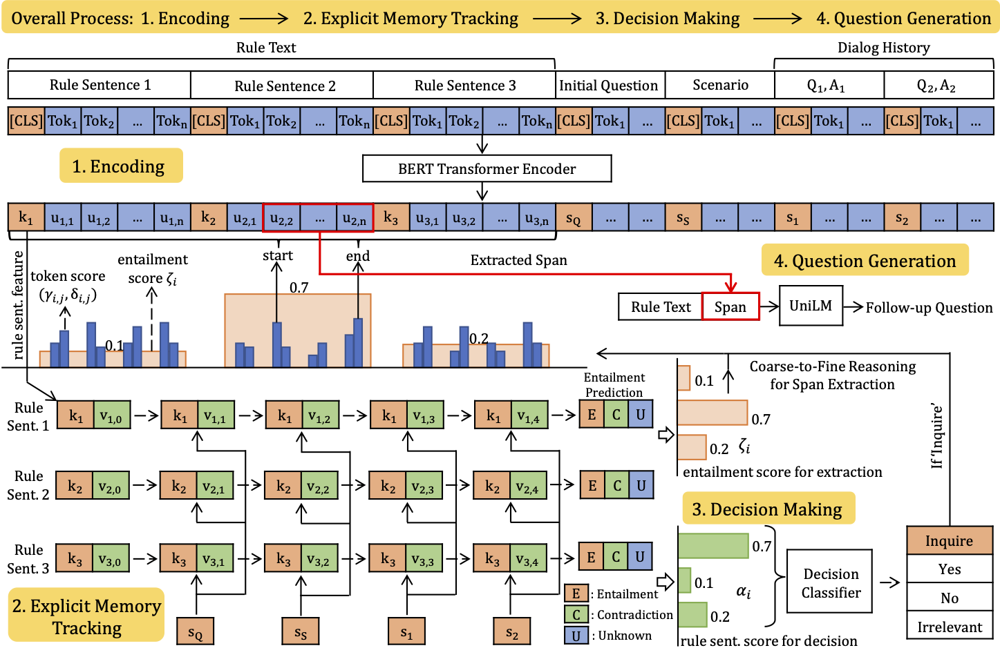

# Explicit Memory Tracker with Coarse-to-Fine Reasoning for Conversational Machine Reading (ACL 2020)

This repository is the official implementation of the ACL 2020 Paper [Explicit Memory Tracker with Coarse-to-Fine Reasoning for Conversational Machine Reading](https://arxiv.org/abs/2005.12484).

`EMT+entailment` achieves new state-of-the-art results on [ShARC conversational machine reading benchmark](https://sharc-data.github.io/leaderboard.html) (Mar 2020).


## Citation

If you find our code useful, please cite our paper as follows:

```bibtex
@article{gao-etal-2020-explicit,
  title={Explicit Memory Tracker with Coarse-to-Fine Reasoning for Conversational Machine Reading},
  author={Yifan Gao and Chien-Sheng Wu and Shafiq R. Joty and Caiming Xiong and Richard Socher and Irwin King and Michael R. Lyu and Steven C. H. Hoi},
  journal={ArXiv},
  year={2020},
  volume={abs/2005.12484}
}
```

## Model Architecture



## Requirements

> Main environment (`PYT_EMT`)

```bash
conda create -n emt python=3.6
conda install pytorch==1.0.1 cudatoolkit=10.0 -c pytorch
conda install spacy==2.0.16 scikit-learn
python -m spacy download en_core_web_lg && python -m spacy download en_core_web_md
pip install pytorch-pretrained-bert==0.4.0 editdistance==0.5.2
```

> UniLM question generation environment (`PYT_QG`)

```bash
# create conda environment
conda create -n qg python=3.6
conda install pytorch==1.1 cudatoolkit=10.0 -c pytorch
conda install spacy==2.0.16 scikit-learn
python -m spacy download en_core_web_lg && python -m spacy download en_core_web_md
pip install editdistance==0.5.2

# install apex
git clone -q https://github.com/NVIDIA/apex.git
cd apex
git reset --hard 1603407bf49c7fc3da74fceb6a6c7b47fece2ef8
python setup.py install --cuda_ext --cpp_ext
cd ..

# setup unilm
cd qg
pip install --editable .
```

> Download ShARC data
```bash
mkdir data
cd data
wget --quiet https://sharc-data.github.io/data/sharc1-official.zip
unzip sharc1-official.zip
rm sharc1-official.zip
mv sharc1-official sharc
```

> Download BERT, UniLM
```bash
mkdir pretrained_models
# BERT
wget --quiet https://s3.amazonaws.com/models.huggingface.co/bert/bert-base-uncased.tar.gz -O pretrained_models/bert-base-uncased.tar.gz
wget --quiet https://s3.amazonaws.com/models.huggingface.co/bert/bert-base-uncased-vocab.txt -O pretrained_models/bert-base-uncased-vocab.txt
wget --quiet https://s3.amazonaws.com/models.huggingface.co/bert/bert-large-cased-vocab.txt -O pretrained_models/bert-large-cased-vocab.txt
wget --quiet https://s3.amazonaws.com/models.huggingface.co/bert/bert-large-cased.tar.gz -O pretrained_models/bert-large-cased.tar.gz
# UniLM
wget --quiet https://unilm.blob.core.windows.net/ckpt/unilm1-large-cased.bin -O pretrained_models/unilmv1-large-cased.bin
cd pretrained_models
tar -zxvf bert-large-cased.tar.gz
rm bert-large-cased.tar.gz
```
You can also download our pretrained models and our dev set predictions: 
- Decision Making Model: [dm.pt](https://mycuhk-my.sharepoint.com/:u:/g/personal/1155102332_link_cuhk_edu_hk/EWraeMP0rstLgIyQor3yy-kB02123QrSWQRv3SadxXqGsg?e=BjVKF5)
- Question Generation Model: [qg.bin](https://mycuhk-my.sharepoint.com/:u:/g/personal/1155102332_link_cuhk_edu_hk/ETIbJRPfffVAk6zTWFOPQhsBxKVLxQfrVT6_UKHZs1vRrQ?e=6Z3rxD)
- Predictions on the dev set: [dev.preds.json](https://mycuhk-my.sharepoint.com/:u:/g/personal/1155102332_link_cuhk_edu_hk/EUXZWk-TWOVAmocFudeFatwB10neMRGINxMbIcEcv5W-XA?e=UxyDoc)
> We would now set up our directories like this:

```
.
└── dm
    └── ...
└── qg
    └── ...
└── README.md
└── preprocess_dm.py
└── preprocess_qg.py
└── train_dm.sh
└── train_qg.sh
└── inference_e2e.sh
└── inference_oracle_qg.sh
└── data
    └── sharc ...
└── pretrained_models
    └── bert/unilm ...
    └── dm.pt
    └── qg.bin
    └── dev.preds.json
```


## Preprocessing

> preprocess decision making
```
PYT_EMT preprocess_dm.py
```

> preprocess question generation
```
PYT_QG preprocess_qg.py
```

## Training

> Decision Making + Underspecified Span Extraction

Configue `PYT_EMT` in `train_dm.sh` first, and run

```
mkdir -p saved_models
./train_dm.sh <GPU_ID>
```

The trained decision making model should be at `saved_models/lew_10_lsw_0.6/seed_28/best.pt` by default.

The decision making predictions should be at `saved_models/lew_10_lsw_0.6/seed_28/dev.preds.json` by default.

> Question Generation

Configue `PYT_QG` in `train_qg.sh` first, and run

```
mkdir -p saved_models
./train_qg.sh <GPU_ID>
```

The trained question generation model should be at `saved_models/unilm_16_0.00002_20/model.20.bin` by default.


`Note: Because the dataset is relatively small (~20k), the results are highly dependent on your environment and the random seed. To replicate our results in the paper, you can use our pretrained models.`

## Evaluation

### End-to-End Task

To evaluate EMT on the end-to-end task, configue `PYT_QG` in `inference_e2e.sh`, and run

```eval
./inference_e2e.sh <GPU_ID> pretrained_models/dm.pt pretrained_models/qg.bin path/to/bert/base/uncased/pt
```

Our model achieves the following performance on the development set using our pre-trained models:

| Micro Acc. | Macro Acc. | BLEU1 | BLEU4 |
|:----------:|:----------:|:-----:|:-----:|
|    73.22   |    78.28   | 67.48 |  53.2 |

You can replace `dm.pt` & `qg.bin` with your trained models to get your own results.

### Oracle Question Generation Task

To evaluate EMT on the oracle QG task, configue `PYT_QG` in `inference_oracle_qg.sh`, and run,run

```bash
./inference_oracle_qg.sh <GPU_ID> <path-to-dev.preds.json> <path-to-trained-qg-model>
# OR, use our pretrained QG model and our dev predicted data
./inference_oracle_qg.sh <GPU_ID> pretrained_models pretrained_models/qg.bin
```

Oracle question generation results on the Dev. set:

| BLEU1 | BLEU4 |
|:-----:|:-----:|
| 63.50 | 48.65 |


## Acknowledgements

Portions of the source code are based on the [E3](https://github.com/vzhong/e3) project.

The work was done when the first author was an intern at [Salesforce Research](https://einstein.ai/).

If you have any issue, please open an issue or contact yifangao95@gmail.com


